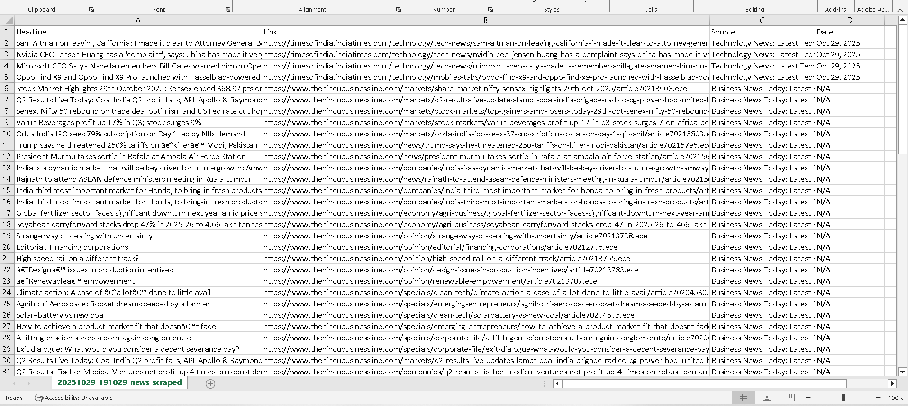

# 📰 Multi-Site News Aggregator


Asynchronous web scraper...
Asynchronous web scraper that concurrently aggregates news headlines from multiple Indian news sources into a single CSV file.

## ✨ Features

- **Concurrent Scraping**: Uses Python async/await to scrape multiple sites simultaneously
- **Multi-Site Support**: 
  - Times of India (Technology)
  - The Hindu Business Line
  - Indian Express (Explained section)
- **Robust Error Handling**: Continues scraping even if individual items fail
- **Comprehensive Logging**: Debug-level logging for troubleshooting
- **Clean Data Export**: UTF-8 encoded CSV with timestamp
- **Fallback Selectors**: Multiple CSS selectors per site for reliability

## 🛠️ Tech Stack

- **Python 3.x**
- **Playwright** (async_api) - Browser automation
- **Pandas** - Data manipulation and CSV export
- **asyncio** - Concurrent execution
- **logging** - Structured logging

## 📦 Installation

### 1. Clone the repository
```bash
git clone https://github.com/Aditya01-crypto/news-aggregator.git
cd news-aggregator
```

### 2. Install dependencies
```bash
pip install -r requirements.txt
```

### 3. Install Playwright browsers
```bash
playwright install chromium
```

## 🚀 Usage

### Basic Usage (Headless Mode)
```bash
python news_scraper.py
```

The scraper will:
1. Open each news site concurrently
2. Extract headlines, links, sources, and dates
3. Save to CSV: `YYYYMMDD_HHMMSS_news_scraped.csv`

### View Browser While Scraping
To see the browser in action (for debugging):
```python
# In news_scraper.py, modify this line:
browser = await p.chromium.launch(headless=False, slow_mo=500)
```

## 📊 Output Format

**CSV Structure:**
```csv
Headline,Link,Source,Date
"Microsoft announces new AI features",https://...,Technology News...,Oct 29, 2025
"Stock market hits new high",https://...,The Hindu BusinessLine,N/A
```

**File naming:** `20251029_143052_news_scraped.csv`

## 🔧 Customization

### Add More Sites
```python
async def main():
    result = await asyncio.gather(
        toi(context, 'https://timesofindia.indiatimes.com/technology'),
        theHinduNews(context, 'https://www.thehindubusinessline.com/'),
        indianExpress(context, 'https://indianexpress.com/section/explained/'),
        # Add your new function here
    )
```

### Change News Categories
Modify the URLs in the `main()` function:
```python
toi(context, 'https://timesofindia.indiatimes.com/business')  # Business instead of Tech
```

### Adjust Logging Level
```python
logger.setLevel(logging.INFO)  # Less verbose
logger.setLevel(logging.DEBUG)  # More verbose
```

## 🎯 Key Features Explained

### Async Concurrent Scraping
```python
result = await asyncio.gather(
    toi(context, url1),
    theHinduNews(context, url2),
    indianExpress(context, url3)
)
```
All three sites are scraped **simultaneously**, reducing total time from ~30 seconds to ~10 seconds.

### Multiple Selector Fallback
```python
selectors = [
    ".wAaWq",   # Primary selector
    ".GLeza",   # Fallback 1
    ".adKsS"    # Fallback 2
]
```
If one selector fails, the scraper tries the next one.

### Comprehensive Error Handling
- Item-level: Skips individual failed items
- Selector-level: Continues with next selector
- Site-level: Returns empty list if entire site fails

## 📝 Code Structure
```
news_scraper.py
├── Logger setup (formatted, structured logging)
├── toi()           - Times of India scraper
├── theHinduNews()  - The Hindu scraper
├── indianExpress() - Indian Express scraper
└── main()          - Orchestrates concurrent execution
```

## ⚠️ Notes

- **Headless by default**: Browser runs in background (faster)
- **Respects site structure**: Uses CSS selectors that match current HTML
- **Educational purpose**: For learning web scraping techniques
- **Rate limiting**: Consider adding delays for production use
- **Site changes**: Selectors may need updates if sites redesign

## 📸 Demo



## 🚧 Future Improvements

- [ ] Add command-line arguments for site selection
- [ ] Implement rate limiting and request throttling
- [ ] Add data deduplication across sites
- [ ] Export to JSON in addition to CSV
- [ ] Add sentiment analysis for headlines
- [ ] Create scheduling script for daily runs
- [ ] Add email notifications for new articles
- [ ] Implement caching to avoid re-scraping

## 🐛 Troubleshooting

**Issue:** `TimeoutError` or pages not loading
```python
# Increase timeout
await page.goto(url, timeout=60000)  # 60 seconds
```

**Issue:** Selectors not finding elements
```python
# Enable headed mode to inspect
browser = await p.chromium.launch(headless=False)
```

**Issue:** Too many logs
```python
logger.setLevel(logging.WARNING)  # Only warnings and errors
```

## 📄 License

MIT License - Feel free to use and modify

## 👤 Author

**[Aditya Padiyara]**
- GitHub: [@Aditya01-crypto](https://github.com/Aditya01-crypto)
- Learning web scraping, automation, and async Python
- Building towards becoming a Backend Developer + Security Specialist

## 🙏 Acknowledgments

- Built while learning Playwright and async Python
- Part of a journey to master web automation and scraping
- Thanks to the open-source community for amazing tools

---

⭐ **Star this repo if you found it useful!**

💬 **Questions?** Open an issue or reach out!


📧 **Hire me for scraping projects:** [connectwithaditya04@gmail.com]

